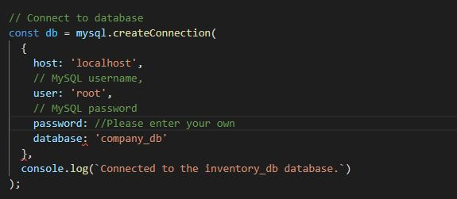
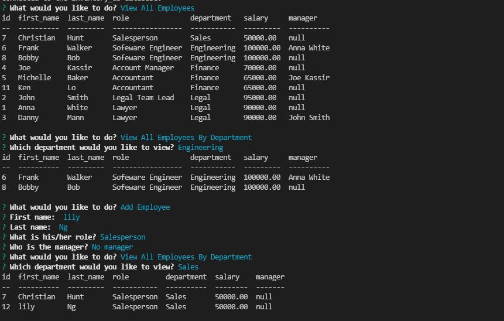

# Employee_Tracker

This app can help company manage their employee and track their salaries. It can view, add, and remove roles and departments. It can also add employee and assign manager. Currently, I am working on the feature of view employee by manager, change employee's manager, and view total utilized budget by department. After adding these features, I will combine some functions to make the code shorter and simple. 

#### Make sure change your password for your sql.

#### Sample output below. 

#### Video Demo for this app
https://watch.screencastify.com/v/XyHf9Yj6ZJsQBKuXH6NV

## Built With
* Javascript

## License
Licensed under the MIT license.

